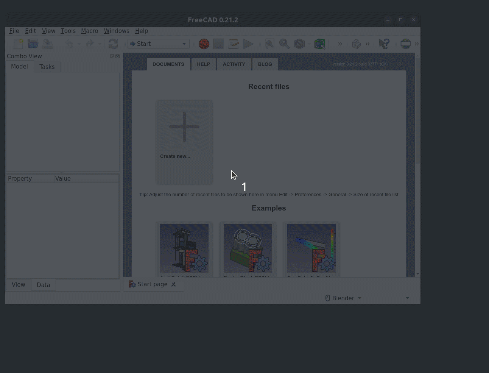
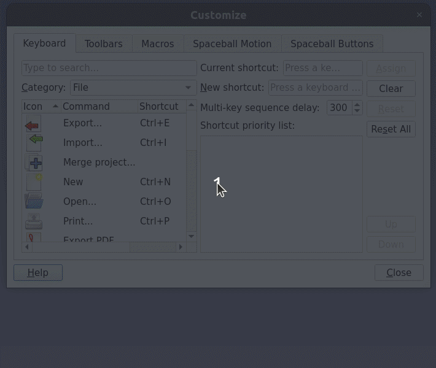

# FreeCAD SweetHome3D add-on

[](https://github.com/FreeCAD/FreeCAD-addons)

A [FreeCAD](https://www.freecadweb.org) workbench to import SweetHome3D files

## Introduction

SweetHome3D is a free interior design application which helps you draw the plan of your house, arrange furniture on it and visit the results in 3D.

## Installation

## Usage

In FreeCAD console, simply call the `SH3D_Import` command:

```python
import SH3D_Import
Gui.runCommand('SH3D_Import',0)
```



Alternatively you can customize your toolbar and add the `Import SweetHome3D files` from the `SH3D_Import` package



## Testing

## Contributing

Any contributions are welcome! Please read our [Contributing](./docs/Contributing.md) guidelines beforehand.

## Feedback

For feedback, bugs, feature requests, and further discussion please use a dedicated FreeCAD forum thread, or open an issue in this Github repo.

## Code of Conduct

This project is covered by FreeCAD [Code of Conduct](https://github.com/FreeCAD/FreeCAD/blob/master/CODE_OF_CONDUCT.md).
Please comply to this code in all your contributions (issue openings, pull requests...).

## Temporary debugging of SNAP base file

In order be able to rapidly test a fix impacting a file within the SNAP distribution you can:

1. Copy the impacted file somewhere you can modify it:

```shell
TARGET=/snap/freecad/current/usr/Mod/AddonManager/addonmanager_devmode_metadata_checker.py
cp $TARGET /tmp/addonmanager_devmode_metadata_checker.py
```

1. Mount bind the file into the SNAP

```shell
mount -o ro,bind /tmp/addonmanager_devmode_metadata_checker.py $TARGET
```

1. Once done, simply unmount the target:

```shell
umount $TARGET
```

An alternative is to link to the git repository pointing to the version of your snap.